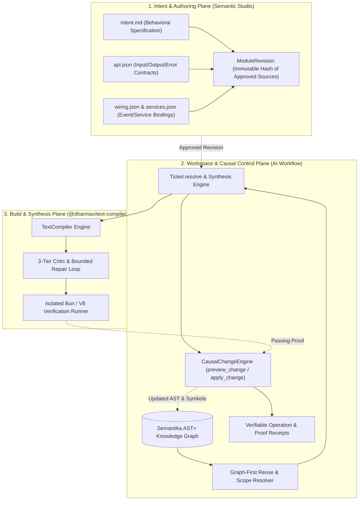

# 🏛️ Graph-Aware Verified Code Synthesis Architecture
### *Autonomous, Self-Verifying Codelet & Structural Synthesis on Semantika AST+ with Semantic Studio Alignment*

---

## 🎯 1. Executive Summary & Problem Statement

### The Problem in Current AIWF Resolution
In current `Ticket.resolve` (`src/graph/ontology.ts`), when the system authors new code or modifies an existing file:
1. **Raw String Injection**: It relies on unverified LLM text generation or literal string replacements (`replace_text`) directly against source files.
2. **Missing Pre-Flight Verification**: There is no isolated, pre-execution verification step proving that a newly authored function satisfies its logic, contracts, and type invariants *before* mutating disk and committing to git.
3. **Graph-Blind Synthesis**: It does not leverage Semantika AST+ to first discover and reuse existing types, helper utilities, schemas, and imported modules. This leads to code duplication and signature mismatches.
4. **Non-Function Construct Blindness**: It has no formal strategy for synthesizing structural constructs (TypeScript `type`, `interface`, `class`, configuration blocks, and modern Riot.js/PWA UI components).

### The Solution: Graph-Aware Verified Synthesis
A unified synthesis control plane that bridges **AIWF** (the durable causal control plane and AST+ knowledge graph), **`@dharmax/text-compiler`** (the JIT candidate compiler with bounded criticism and repair), and **Semantic Studio** (the intent authoring platform and module revision authority).

---

## 🌐 2. System Boundaries & Tri-Partite Architecture



### Boundary Invariants
1. **Semantic Studio owns Intent & Specifications**: Approved `intent.md`, `api.json`, and `services.json` define the normative contract.
2. **AIWF owns Workspace Control & Durable Memory**: Tracks AST symbols, relationships, leases, operations, diagnostics, and git commits.
3. **`text-compiler` owns Isolated Candidate Generation & Repair**: Generates candidate codelets and executes tests in isolated harnesses without touching the host repo.

---

## 🔄 3. The 4-Stage Synthesis Lifecycle

Every synthesis request follows a strictly forward, verified pipeline:

```
Stage 1: Graph-First Resolution (Reuse Before Synthesis)
   │
   ▼
Stage 2: Contract & Construct Decomposition (Functions vs. Non-Functions)
   │
   ▼
Stage 3: JIT Candidate Compilation & Isolated Pre-Flight Test
   │
   ▼
Stage 4: Fingerprinted Preview, Workspace Apply & AST Ingestion
```

---

### Stage 1: Graph-First Resolution (Reuse Before Synthesis)
Before asking any LLM or compiler to generate code, the system queries the Semantika AST+ graph:

1. **Symbol & Contract Lookup**:
   - Matches intent tokens and parameter signatures against existing indexed `SymbolNode`s (`find_symbol`, `search_graph`).
   - If an existing function or type already satisfies the requirement, it is selected for import/reuse rather than duplicated.
2. **Context & Scope Boundary**:
   - Gathers exact type definitions, container classes, and imports currently visible to the target module (`deps <file>`, `slice <file> <symbol>`).
   - Ensures any generated code strictly references already existing types rather than inventing ghost types.

---

### Stage 2: Construct Classification & Strategy

| Construct Type | Examples | Synthesis Strategy | Verification Gate |
|---|---|---|---|
| **Executable Units (Functions / Methods)** | Parsers, algorithms, event handlers, service adapters | Atomic codelet compilation via `@dharmax/text-compiler` with paired test harness | **Isolated Test Execution**: Test must invoke function, assert output, and exit code 0 *before* disk mutation. |
| **Structural Types & Contracts** | `type`, `interface`, Zod schemas, DTOs | Schema-driven TypeScript generator with exact Semantika type grounding | **TypeScript LSP Syntax & Type Diagnostics**: 0 syntax/type errors in LSP in-memory document. |
| **Classes & Stateful Services** | State machines, repository classes, domain controllers | Context-chained multi-function decomposition (`TextCompilerSkillAuthor` pattern) | **Unit & Method Contract Tests**: Individual methods verified, then class integration verified. |
| **UI Components** | Modern Riot.js components, menu navigation, multi-step wizards | Component synthesis conforming to Universal UI Protocol (Riot.js 10, `@dharmax/state-router`, `@dharmax/pubsub`, `@dharmax/field-assist`, modern CSS nesting) | **DOM / Component Test**: Headless verification with `happy-dom` / Bun test assertions. |

---

### Stage 3: JIT Compilation & Pre-Flight Verification Harness

When an executable function is synthesized:
1. **Compilation Request**:
   - Input: Intent, parameter types, return type, and bound dependencies resolved from Stage 1.
   - Requirement: `@dharmax/text-compiler` must produce both `sourceCode` and `testSourceCode`.
2. **Isolated Verification Execution**:
   - The generated `testSourceCode` is executed against the candidate function in an isolated process or sandbox harness.
   - If assertions fail, the compiler's 3-tier critic performs bounded repair (up to 2 iterations).
   - If verification fails completely, the operation fails closed with the concrete test error, leaving the project workspace clean.

---

### Stage 4: Fingerprinted Apply & AST Graph Ingestion

Once verified:
1. **`preview_change` Boundary**:
   - Previews the insertion (or surgical `replace_symbol`) with a SHA-256 fingerprint encompassing the code change and its verified test receipt.
2. **`apply_change`**:
   - Applies the edit via TypeScript LSP workspace edits.
   - Automatically triggers `ensureAstFresh()` to re-index the file into the Semantika AST+ store.
   - Immediately checks LSP diagnostics across the target file and its callers to guarantee zero compile regressions.

---

## 📐 4. Proposed Causal Change Engine Additions

To make code synthesis a first-class citizen of AIWF's `CausalChangeEngine`, we extend `ChangeRequest` in `src/change/types.ts`:

```ts
export type ChangeRequest =
  | ExistingChangeRequests
  | {
      action: 'synthesize_function';
      filePath: string;
      functionName: string;
      intent: string;
      signature?: string;
      dependencies?: string[]; // Graph symbol IDs to thread into scope
      testAssertions?: string;  // Explicit behavioral assertions to prove
    }
  | {
      action: 'synthesize_construct';
      filePath: string;
      constructKind: 'type' | 'interface' | 'class' | 'component';
      name: string;
      specification: string;
      dependencies?: string[];
    };
```

---

## 🔗 5. Semantic Studio Coexistence & Migration

As documented in `SEMANTIC_STUDIO_AIWF_ARCHITECTURE_PROPOSAL.md`:
- **AIWF does not absorb Semantic Studio**, and deployed applications do not bundle AIWF.
- AIWF provides the **instance-owned host** and **durable store** for Studio's control plane.
- Studio provides the **visual cockpit**, **domain ontology**, and **authoring UX**.
- Both share the same underlying AST+, `@dharmax/text-compiler`, and `@dharmax/semantika` primitives.

---

## 🛡️ 6. Invariants & Guardrails
- **Extreme KISS**: Do not invent parallel AST parsers or shadow execution environments. Use native Semantika predicates and Bun's test runner.
- **Fail Closed**: No unverified code is ever written to disk. A failing test during synthesis terminates with an actionable error.
- **Graph Truth**: All synthesized symbols are immediately queryable via `find_symbol`, `get_symbol_source`, and `search_graph`.
